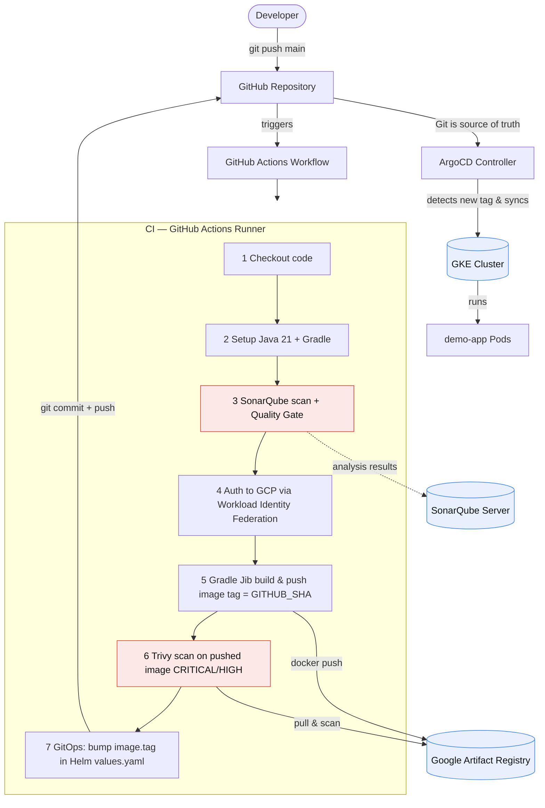

# Secure CI/CD + GitOps on GCP

A production-grade reference implementation for building, scanning, and deploying a Java
(Spring Boot) service to **Google Kubernetes Engine (GKE)** using **GitHub Actions**,
**SonarQube**, **Jib**, **Google Artifact Registry**, **Trivy**, **Helm**, and **ArgoCD**.

The pipeline is **keyless** — it authenticates to GCP via **Workload Identity Federation**
(no long-lived JSON service-account keys stored in GitHub).

---

## Table of Contents

1. [Architecture Diagram](#1-architecture-diagram)
2. [Repository Structure](#2-repository-structure)
3. [How the Pipeline Works](#3-how-the-pipeline-works)
4. [Prerequisites](#4-prerequisites)
5. [Step 1 — GCP Foundation (APIs, Artifact Registry, GKE)](#step-1--gcp-foundation)
6. [Step 2 — Workload Identity Federation (keyless auth)](#step-2--workload-identity-federation)
7. [Step 3 — GitHub Secrets & Variables](#step-3--github-secrets--variables)
8. [Step 4 — SonarQube setup](#step-4--sonarqube-setup)
9. [Step 5 — Install ArgoCD & bootstrap the app](#step-5--install-argocd--bootstrap-the-app)
10. [Step 6 — Run the pipeline](#step-6--run-the-pipeline)
11. [Local development](#7-local-development)
12. [GitOps: single repo vs dedicated repo](#8-gitops-single-repo-vs-dedicated-repo)
13. [Troubleshooting](#9-troubleshooting)

---

## 1. Architecture Diagram



**End-to-end flow:** Developer push → GitHub Actions → SonarQube (gate) → Gradle Jib →
Artifact Registry → Trivy (gate) → GitOps/Helm tag bump → ArgoCD → GKE.

---

## 2. Repository Structure

```text
secure-cicd-gcp/
├── README.md                        # This guide
├── build.gradle                     # Gradle build + Jib + SonarQube config
├── settings.gradle
├── gradle.properties
├── Dockerfile                       # OPTIONAL multistage fallback (Jib is primary)
├── sonar-project.properties         # SonarQube analysis settings
├── .gitignore
│
├── src/
│   └── main/
│       ├── java/com/example/demo/
│       │   ├── DemoApplication.java         # Spring Boot entry point
│       │   └── controller/HelloController.java  # REST endpoints
│       └── resources/
│           └── application.yml              # Port + actuator probes
│
├── .github/
│   └── workflows/
│       └── ci-cd.yaml               # The full CI/CD pipeline
│
├── helm/
│   └── demo-app/                    # Production-ready Helm chart
│       ├── Chart.yaml
│       ├── values.yaml              # image.tag is auto-bumped by CI
│       └── templates/
│           ├── _helpers.tpl
│           ├── deployment.yaml
│           ├── service.yaml
│           ├── serviceaccount.yaml
│           └── hpa.yaml
│
└── argo/
    ├── application.yaml             # Standard ArgoCD Application
    └── app-of-apps.yaml             # OPTIONAL App-of-Apps root
```

---

## 3. How the Pipeline Works

On every push to `main`, `.github/workflows/ci-cd.yaml` runs these stages in order:

| # | Stage | Tool | Gate? |
|---|-------|------|-------|
| 1 | Checkout | `actions/checkout` | — |
| 2 | Setup Java 21 + Gradle | `setup-java`, `setup-gradle` | — |
| 3 | Code quality & security scan | **SonarQube** | ✅ Quality Gate fails build |
| 4 | Keyless GCP auth | **Workload Identity Federation** | — |
| 5 | Build & push image (`tag = $GITHUB_SHA`) | **Jib → Artifact Registry** | — |
| 6 | Image vulnerability scan | **Trivy** (`CRITICAL,HIGH`) | ✅ Fails build on findings |
| 7 | Bump `image.tag` in Helm values, commit back | **yq + git** (GitOps) | — |

ArgoCD (running in-cluster) watches Git, sees the new tag, and syncs the change to GKE.

---

## 4. Prerequisites

Install locally:

- **gcloud CLI** (`gcloud`, `gsutil`)
- **kubectl**
- **helm** (v3+)
- **git**
- **Java 21** + a way to generate the Gradle wrapper (`gradle wrapper`) — see below
- A **GitHub repository** you own
- A reachable **SonarQube server** (SonarCloud or self-hosted; must be reachable from the GitHub runner)

> **Generate the Gradle wrapper once** (so CI doesn't need Gradle pre-installed):
> ```bash
> gradle wrapper --gradle-version 8.9
> git add gradlew gradlew.bat gradle/wrapper && git commit -m "chore: add gradle wrapper"
> ```
> The workflow uses `gradle/actions/setup-gradle`, which also works without the wrapper,
> but committing the wrapper is best practice for reproducibility.

Set these shell variables (used throughout):

```bash
export PROJECT_ID="my-gcp-project"
export REGION="us-central1"
export GAR_REPO="containers"
export CLUSTER="demo-gke"
export GH_ORG="your-github-user-or-org"
export GH_REPO="secure-cicd-gcp"
gcloud config set project "$PROJECT_ID"
```

---

## Step 1 — GCP Foundation

Enable APIs, create the Artifact Registry repo, and a GKE cluster.

```bash
# 1. Enable required APIs
gcloud services enable \
  artifactregistry.googleapis.com \
  container.googleapis.com \
  iamcredentials.googleapis.com \
  iam.googleapis.com

# 2. Create the Artifact Registry (Docker format)
gcloud artifacts repositories create "$GAR_REPO" \
  --repository-format=docker \
  --location="$REGION" \
  --description="Container images"

# 3. Create a GKE cluster (Autopilot recommended for simplicity)
gcloud container clusters create-auto "$CLUSTER" --region "$REGION"

# 4. Get cluster credentials
gcloud container clusters get-credentials "$CLUSTER" --region "$REGION"
```

Your images will live at:
`us-central1-docker.pkg.dev/$PROJECT_ID/$GAR_REPO/demo-app:<git-sha>`

---

## Step 2 — Workload Identity Federation

This lets GitHub Actions authenticate to GCP **without a JSON key**.

```bash
export POOL="github-pool"
export PROVIDER="github-provider"
export SA="gha-deployer"
export PROJECT_NUMBER=$(gcloud projects describe "$PROJECT_ID" --format='value(projectNumber)')

# 1. Create the deployer service account
gcloud iam service-accounts create "$SA" \
  --display-name="GitHub Actions deployer"
export SA_EMAIL="${SA}@${PROJECT_ID}.iam.gserviceaccount.com"

# 2. Grant it permission to push to Artifact Registry
gcloud projects add-iam-policy-binding "$PROJECT_ID" \
  --member="serviceAccount:${SA_EMAIL}" \
  --role="roles/artifactregistry.writer"

# 3. Create a Workload Identity Pool
gcloud iam workload-identity-pools create "$POOL" \
  --location="global" --display-name="GitHub pool"

# 4. Create an OIDC provider for GitHub, restricted to YOUR repo
gcloud iam workload-identity-pools providers create-oidc "$PROVIDER" \
  --location="global" \
  --workload-identity-pool="$POOL" \
  --display-name="GitHub provider" \
  --attribute-mapping="google.subject=assertion.sub,attribute.repository=assertion.repository" \
  --attribute-condition="assertion.repository=='${GH_ORG}/${GH_REPO}'" \
  --issuer-uri="https://token.actions.githubusercontent.com"

# 5. Allow the GitHub repo to impersonate the service account
gcloud iam service-accounts add-iam-policy-binding "$SA_EMAIL" \
  --role="roles/iam.workloadIdentityUser" \
  --member="principalSet://iam.googleapis.com/projects/${PROJECT_NUMBER}/locations/global/workloadIdentityPools/${POOL}/attribute.repository/${GH_ORG}/${GH_REPO}"

# 6. Print the values you need for GitHub Secrets
echo "WIF_PROVIDER=projects/${PROJECT_NUMBER}/locations/global/workloadIdentityPools/${POOL}/providers/${PROVIDER}"
echo "WIF_SERVICE_ACCOUNT=${SA_EMAIL}"
```

---

## Step 3 — GitHub Secrets & Variables

In **Settings → Secrets and variables → Actions**:

### Secrets (encrypted)

| Name | Value |
|------|-------|
| `WIF_PROVIDER` | The `projects/.../providers/github-provider` string from Step 2 |
| `WIF_SERVICE_ACCOUNT` | `gha-deployer@PROJECT.iam.gserviceaccount.com` |
| `SONAR_TOKEN` | Token generated in SonarQube (Step 4) |
| `SONAR_HOST_URL` | e.g. `https://sonarcloud.io` or your server URL |

### Variables (non-sensitive)

| Name | Example |
|------|---------|
| `GCP_PROJECT_ID` | `my-gcp-project` |
| `GAR_LOCATION` | `us-central1` |
| `GAR_REPOSITORY` | `containers` |
| `SONAR_PROJECT_KEY` | `demo-app` |

---

## Step 4 — SonarQube Setup

1. Create a project in SonarQube/SonarCloud with key **`demo-app`** (must match
   `SONAR_PROJECT_KEY`).
2. Generate a **token**: *My Account → Security → Generate Token*.
3. Add it to GitHub as `SONAR_TOKEN`, and set `SONAR_HOST_URL`.
4. Configure the **Quality Gate** you want enforced. The workflow's
   `sonarqube-quality-gate-action` step fails the build if the gate is red.

`sonar-project.properties` holds the static config; host URL and token are injected
at runtime and never committed.

---

## Step 5 — Install ArgoCD & Bootstrap the App

```bash
# 1. Install ArgoCD into the cluster
kubectl create namespace argocd
kubectl apply -n argocd -f https://raw.githubusercontent.com/argoproj/argo-cd/stable/manifests/install.yaml

# 2. Wait for it to be ready
kubectl -n argocd rollout status deploy/argocd-server

# 3. Get the initial admin password
kubectl -n argocd get secret argocd-initial-admin-secret \
  -o jsonpath='{.data.password}' | base64 -d; echo

# 4. (Optional) Port-forward the UI
kubectl -n argocd port-forward svc/argocd-server 8081:443
# Browse https://localhost:8081  (user: admin)
```

**Point ArgoCD at your repo:** edit `argo/application.yaml` and replace
`https://github.com/OWNER/REPO.git` with your repository URL, then apply:

```bash
kubectl apply -f argo/application.yaml
# OR use the App-of-Apps pattern:
# kubectl apply -f argo/app-of-apps.yaml
```

> If your GitOps repo is **private**, register repo credentials in ArgoCD:
> `argocd repo add https://github.com/OWNER/REPO.git --username <user> --password <PAT>`

---

## Step 6 — Run the Pipeline

1. Set a real value for `image.repository` in `helm/demo-app/values.yaml`
   (or let the first pipeline run populate it).
2. Commit and push to `main`:

   ```bash
   git add . && git commit -m "feat: initial pipeline" && git push origin main
   ```
3. Watch **Actions** tab. On success it will:
   - pass the SonarQube gate,
   - push `demo-app:<sha>` to Artifact Registry,
   - pass the Trivy scan,
   - commit the new `image.tag` to `helm/demo-app/values.yaml`.
4. ArgoCD detects the change and syncs to GKE. Verify:

   ```bash
   kubectl -n demo-app get pods
   kubectl -n demo-app port-forward svc/demo-app 8080:80
   curl localhost:8080/         # -> greeting JSON
   curl localhost:8080/version  # -> {"version":"<git-sha>"}
   ```

---

## 7. Local Development

```bash
# Run the app locally
./gradlew bootRun

# Build an image to your local Docker daemon (no registry)
./gradlew jibDockerBuild -Djib.to.image=local/demo-app -Djib.to.tag=dev
docker run -p 8080:8080 local/demo-app:dev

# Lint/scan the Helm chart
helm lint helm/demo-app
helm template demo helm/demo-app | kubectl apply --dry-run=client -f -
```

---

## 8. GitOps: Single Repo vs Dedicated Repo

- **Option A (this repo, default):** app code + Helm chart live together; the pipeline
  commits the tag bump back to `helm/demo-app/values.yaml`. Simple, great for demos.
- **Option B (dedicated GitOps repo):** keep manifests in a separate repo for clean
  separation and independent access control. In `ci-cd.yaml`, change the final GitOps
  step to check out the GitOps repo (using a PAT/deploy key), run `yq` there, and push.
  Point `argo/application.yaml`'s `repoURL` at the GitOps repo. **Recommended for prod.**

---

## 9. Troubleshooting

| Symptom | Likely cause / fix |
|---------|--------------------|
| `Permission denied` pushing to GAR | SA missing `roles/artifactregistry.writer`, or wrong `GAR_LOCATION`. |
| WIF auth fails | `attribute-condition` repo name mismatch, or `WIF_PROVIDER` string wrong. |
| SonarQube step hangs | `SONAR_HOST_URL` not reachable from GitHub runner (self-hosted server behind firewall). |
| Trivy fails the build | Real CRITICAL/HIGH CVE — update base image/deps, or tune `severity`/`ignore-unfixed`. |
| ArgoCD `OutOfSync` forever | `repoURL`/`path` wrong, private repo without creds, or namespace missing (`CreateNamespace=true`). |
| Pods `CrashLoopBackOff` | Check probe paths match actuator; ensure `/tmp` volume is mounted (readOnlyRootFilesystem). |
| CI loops on its own commit | Ensure the GitOps commit message contains `[skip ci]` (already included). |

---

**Security notes:** keyless auth (WIF), non-root distroless runtime, read-only root
filesystem, dropped Linux capabilities, `seccompProfile: RuntimeDefault`, two enforced
gates (SonarQube + Trivy), and immutable Git-SHA image tags for full traceability.
